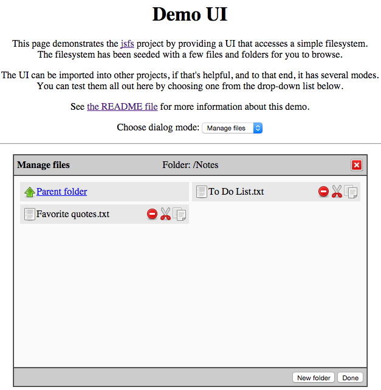

# Demo

## Cut to the chase

To play with the demo:

```
$ git clone https://github.com/nathancarter/jsfs.git
$ cd jsfs
$ npm install
$ ./node_modeuls/.bin/cake all
```

Then point your browser at `jsfs/demo/index.html`.



## Purposes

This demo serves two purposes.

 1. It demonstrates this project by providing a UI that accesses a simple
    filesystem.  The filesystem has been seeded with a few files and folders
    for the user to browse.  Without the demo page, the project is entirely
    in the background; it has no other UI.
 1. If you plan to import `jsfs` into one of your web projects, and you'll
    need a file dialog UI there, then you can take much of the code in this
    demo.  The rest of this document explains how.

## Re-using this demo

The demo has intentionally been factored into two halves.

 1. The page `filedialog.html` can be placed in an `<iframe>` in another
    page, to function as a dialog box.  It imports `filedialog.js`, which is
    compiled from `filedialog.litcoffee` as part of the [jsfs build
    process](../cake.litcoffee).  You probably do not need to inspect the
    code of either of those files.
 1. The shell page that imports it is `index.html`, and it shows you how to
    import the UI into any other app you might like.
    * If `filedialog.html` is loaded in an `<iframe>` in a page, then that
      page will receive messages from the frame about events that happen in
      it.  You can see how to catch and respond to these messages by
      examining the `onmessage` event handler in `index.html`.
    * In addition to the major events in that handler (e.g., "open file,"
      etc.) there are some minor events, such as typing in a "save" text
      box, or selecting a file before opening it.  These can be useful for
      keeping surrounding UI in sync with the frame, and `index.html` just
      drops these as messages to the console.  Observe the console in the
      demo app and you will see all these messages in their exact formats.
    * This demo asks `filedialog.html` to decorate itself like a dialog box,
      with a title bar and a status bar.  If you prefer to provide those UI
      elements yourself, or need to send any other message to the frame, see
      the code at the bottom of `index.html`, which sends messages to the
      frame.

I eventually hope to use this demo in a [TinyMCE](http://www.tinymce.com/)
project, where TinyMCE dialogs for loading and saving files use this UI.  If
and when that happens, I may post further demo code here.
